# Pytorch-CUDA-Pycharm-setup
**Instructions for setting up PyTorch with CUDA in PyCharm IDE**
## 安装步骤
### 1. 在pycharm创建一个项目
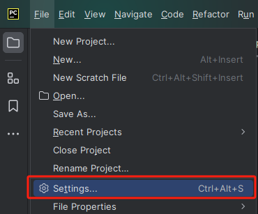
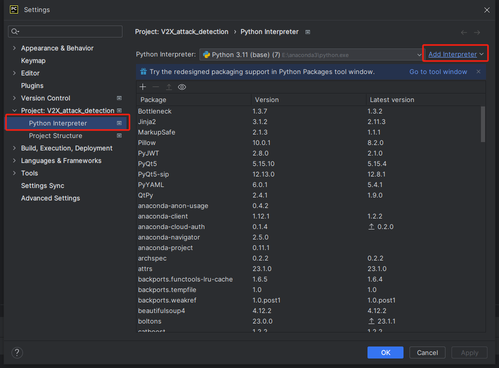
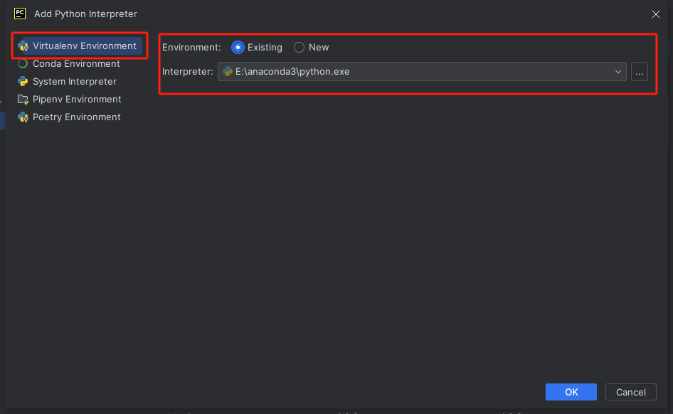
### 2. 查询适合自己显卡的CUDA版本
- 搜索栏搜索`NVIDIA控制面板`，选择`帮助`，选择`系统信息`。
- 选择`组件`找到“NVCUDA.DLL”查看可支持的CUDA版本；选择`显示`查看驱动程序版本。
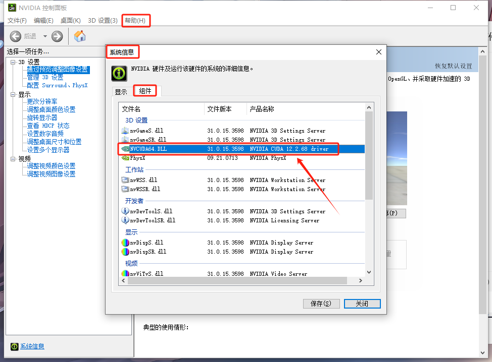
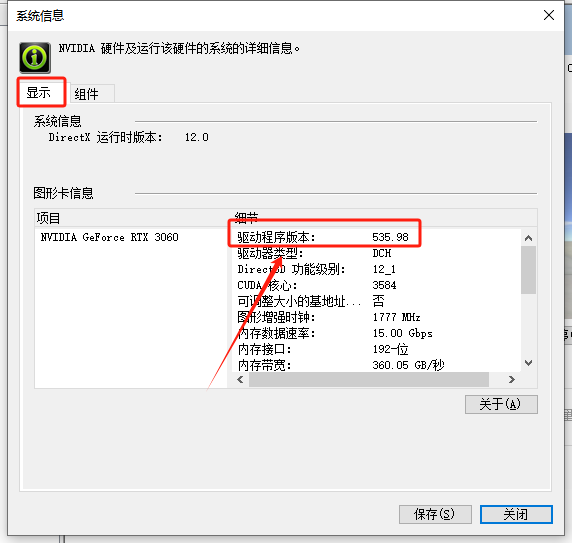
### 3. 下载适合自己显卡的CUDA版本并安装
- 点击[link](https://developer.nvidia.com/cuda-toolkit-archive)查看CUDA版本，下载CUDA

    （我能支持的CUDA版本最高为12.2，以安装12.1.0为例）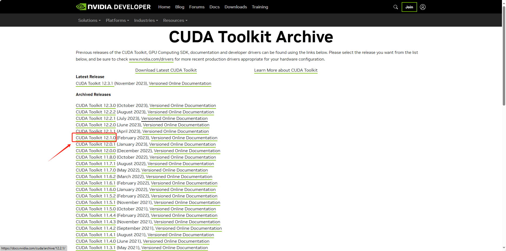
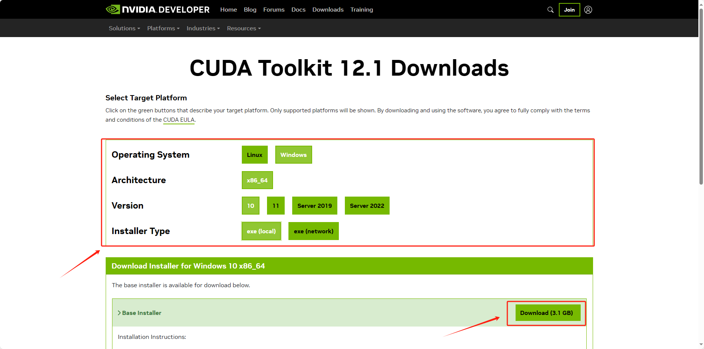
- 安装CUDA：安装过程中，安装选项选择“精简”，然后一路默认。
- 检查CUDA是否安装成功：win+R，打开cmd，键入命令
    ````
    nvcc -V
    ````
    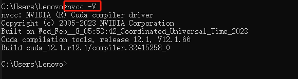
    
    (如上图所示则安装成功，版本为12.1)
### 4. 安装pytorch
- 点击[link](https://pytorch.org/get-started/locally/)，选择适合的pytorch版本。( 注：CUDA可选版本很少，没有一样的则选择与本机CUDA版本接近的即可)
- 复制`Run this Command`中的代码
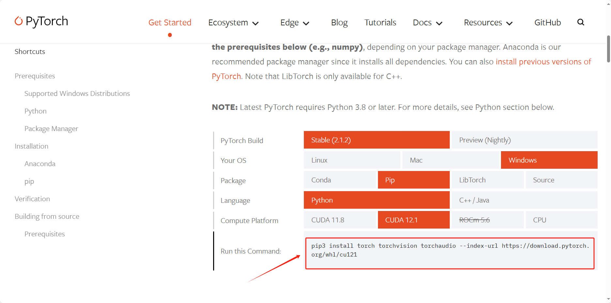
- 在刚创建的python项目中选择terminal终端，键入刚才复制的代码，等待安装。
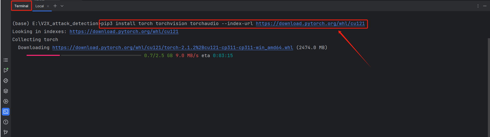
- 检查安装是否成功：在`main.py`中键入代码
    ````
    import torch
    print(torch.__version__)
    print(torch.cuda.is_available())
    ````
- 运行代码
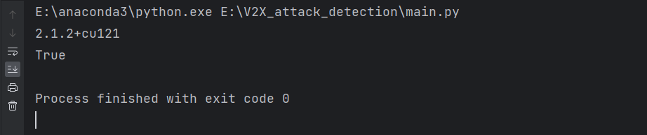
完成！